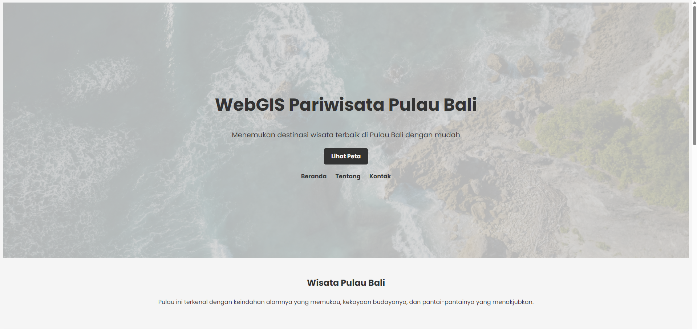
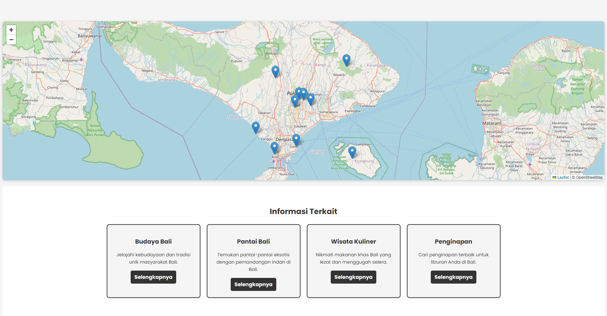

# WebGIS Pariwisata Pulau Bali

## Deskripsi
WebGIS Pariwisata Pulau Bali adalah aplikasi berbasis web yang dirancang untuk membantu pengguna dalam menemukan informasi terkait destinasi wisata di Pulau Bali. Aplikasi ini menyediakan peta interaktif dengan fitur-fitur yang memudahkan navigasi, pencarian tempat wisata, dan informasi terkait tempat wisata seperti deskripsi, lokasi, dan kategori.

## Tujuan WebGIS
1. **Menyediakan informasi lokasi tempat wisata di Bali secara interaktif**
   
   Membantu pengguna untuk mengetahui posisi geografis tempat wisata di Bali dengan memanfaatkan teknologi peta digital.

2. **Meningkatkan aksesibilitas informasi wisata**
   
   Memberikan deskripsi lengkap setiap destinasi, sehingga wisatawan dapat membuat perencanaan perjalanan yang lebih baik.

3. **Mengintegrasikan data wisata dengan teknologi spasial**
   
   Menjadikan pengelolaan data wisata lebih efisien dan mudah diakses oleh berbagai pihak yang membutuhkan.

## Komponen WebGIS
1. **Data Spasial**
   Data spasial berupa koordinat tempat wisata di Pulau Bali yang divisualisasikan dalam bentuk peta interaktif.

2. **GeoJSON**
   Format data yang digunakan untuk menyimpan dan menyajikan informasi spasial tempat wisata. GeoJSON memudahkan integrasi dan pengolahan data dengan library peta seperti Leaflet.

3. **phpMyAdmin**
   Tools yang digunakan untuk mengelola basis data terkait informasi tempat wisata, seperti nama, deskripsi, lokasi, dan kategori.

4. **Bootstrap**
   Framework front-end yang digunakan untuk mendesain antarmuka pengguna yang responsif dan menarik pada aplikasi WebGIS.

## Sumber Data
- [Geoportal Bali](https://geoportal.bali.go.id/#/)
- [Harian Bali](https://balikoran.bali.com/read/2023/02/18/510/1126656/7-kawasan-wisata-di-pulau-bali)

## Tangkapan Layar Komponen Penting Produk
Berikut adalah beberapa tangkapan layar dari aplikasi WebGIS:

1. **Tampilan Utama**  
   

2. **Peta Persebaran Wisata Bali**  
   

## LINK WEBSITE
WEBGIS ini dapat diakses melalui tautan berikut:  
 **[The Klitih WebGIS](https://nafis0403.github.io/responsi_pgweb/)**  
---

Silakan gunakan WebGIS Pariwisata Pulau Bali untuk mempermudah eksplorasi tempat wisata terbaik di pulau ini! Jika Anda memiliki pertanyaan atau masukan, silakan hubungi kami melalui email: `ridhoalifutama@mail.ugm.ac.id`.
